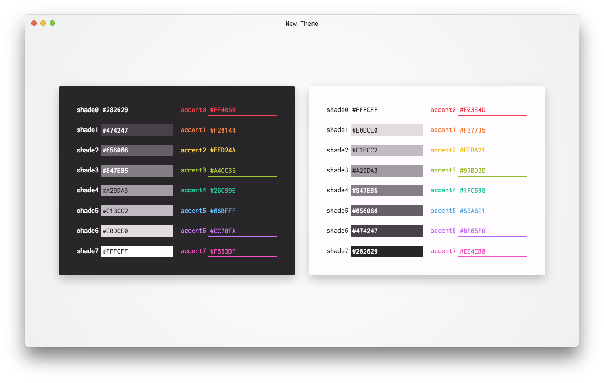

  

# themer-gui  

Themer takes your set of colors (or a built-in set of colors) and generates editor themes, terminal themes, and desktop/device wallpapers.

This repository is a graphical UI for the [command-line tool](https://github.com/mjswensen/themer).

See also [Themer's website](https://themer.mjswensen.com) and [Themer's Product Hunt page](https://www.producthunt.com/posts/themer-2).

## Installation

* macOS, Windows, and Linux: download the [latest release](https://github.com/mjswensen/themer-gui/releases/latest) installer.
